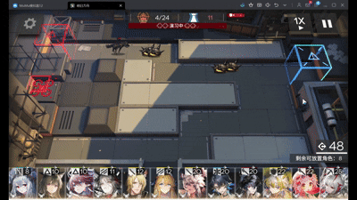
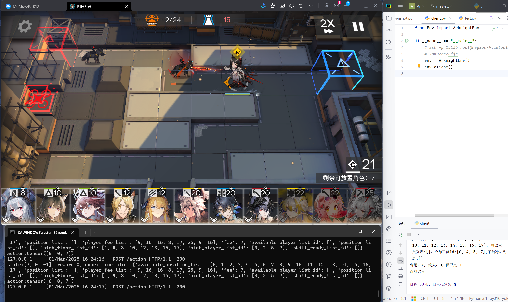

# Arknight Agent 基于强化学习的明日方舟Bot
## 设备

- 手游模拟器(MUMU) - 客户端
- 云服务器/本地设备 - 服务器端
## 注意

由于本人的设备有限，因此该项目是放置在算力服务器上运行，通过接口进行数据传递，server文件为服务器端，使用了flask作为服务框架，client文件为客户端，服务器端负责接受数据并进行动作预测，客户端接受服务器端的数据后进行动作反应
## 环境
- python >= 3.10
## 使用

1. 配置环境

   ```
   conda create --name <env> --file requirements.txt
   ```

2. 配置好环境后服务器端运行server文件，本人使用的服务器厂商只能通过6006端口进行数据传输，**可以根据实际情况进行修改**

3. 客户端同步运行client文件，接收数据，此时就可以看到agent进行动作反应了
## 演示

### 关卡0-5

 <br>

其他关卡演示后续补充，相关代码仍在完善中

### 调试演示


